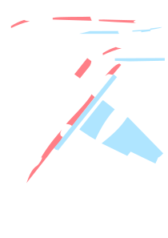

# tu-2

## Окрас

Основной тон -- открытый алюминий

### Изначальные посылы

* стандартный окрас ТУ-2 -- скучный
* есть мысль сделать что-то более утопическое
* самолёт цельно-металлический (кроме элеронов)
* интересно было-бы оставить какое-то колличество открытого металла
* вопрос в сочетании эстетики 30-х годов, гоночных самолётов, mecha, американских полированных мустангов,...

## Эстетика 1930-х
Немного советской эстетики.
Алюминий в моде!
Много крассного цвета!

### И-5
http://alternathistory.com/mikhail-maslov-pervye-istrebiteli-sssr-ot-i-1-do-i-5-skachat/

### И-16
http://alternathistory.com/mihail-maslov-istrebitel-i-16-norovistyj-ishak-stalinskih-sokolov-skachat-besplatno/

### АНТ-25

Рекорд дальности

Амбициозные проекты молодых авиаконструкторов.

## Г-38

http://alternathistory.com/proekt-legkij-krejser-g-38-lk-2/

## Эстетика конца 1930-х

Перспективный И-180, И-185. Аварии. Разбился Чкалов. А мог-бы быть хороший истребитель?

## И-180
http://alternathistory.com/mikhail-maslov-rokovoi-istrebitel-chkalova-i-17-i-180-i-185-skachat/

## Прочие ссылки

* https://northstarmodels.com/2019/06/xuntong-1-48-tu-2/
* https://mpminiatures.wordpress.com/2016/07/19/tupolev-tu-2t-148-scale/
* http://scalemodels.ru/articles/8829-Xuntong-Models-1-48-tu-2t.html
* http://scalemodels.ru/articles/6247-Xuntong-Model-1-48-tu-2t.html
* http://scalemodels.ru/articles/11548-Xuntong-Model-1-48-tu-2s-jeskadril-moskva.html
* https://karopka.ru/forum/forum259/topic20897/
* клёпка : https://ww2aircraft.net/forum/threads/done-gb-40-1-72-tupolev-tu-2s-heavy-hitters-iii.50198/page-2
* https://doogsmodels.com/2012/07/12/a-soviet-trend/
* https://www.eduard.com/eduard/photo-etched-parts/zoom-set/aircraft/1-48/tu-2s-interior-s-a-1-48.html
* https://www.net-maquettes.com/pictures/tupolev-tu-2-walkaround/
